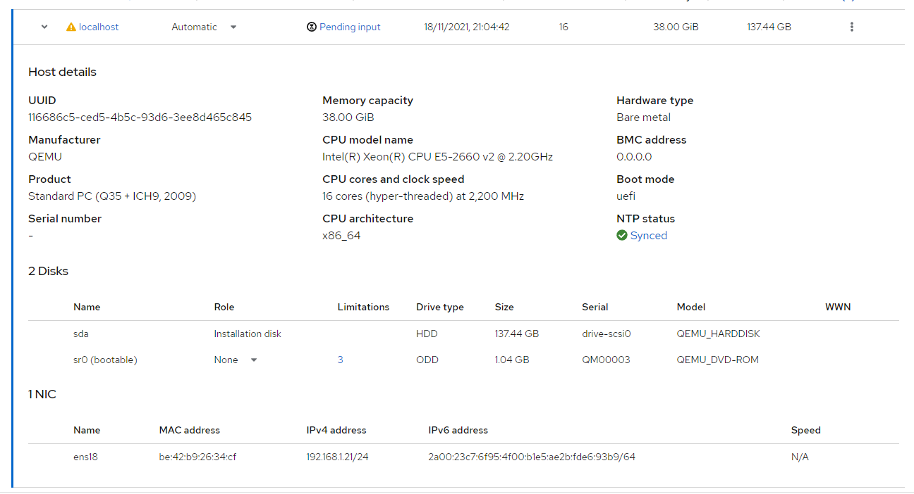
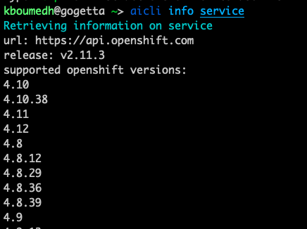
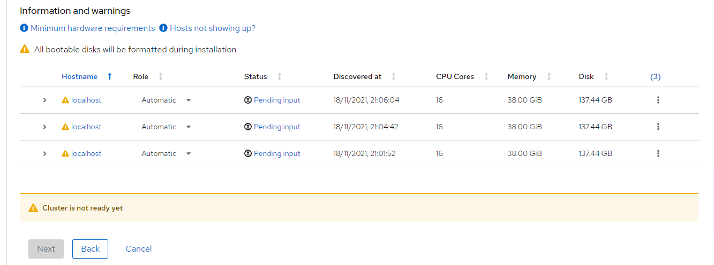
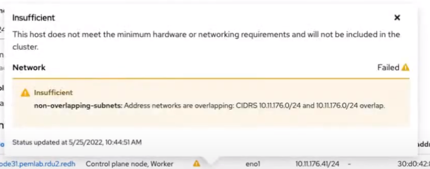
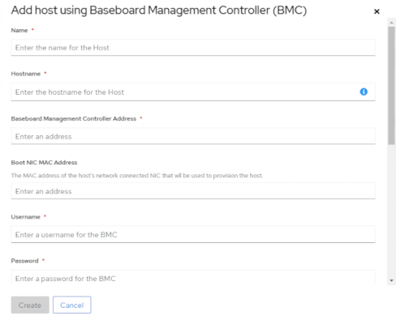
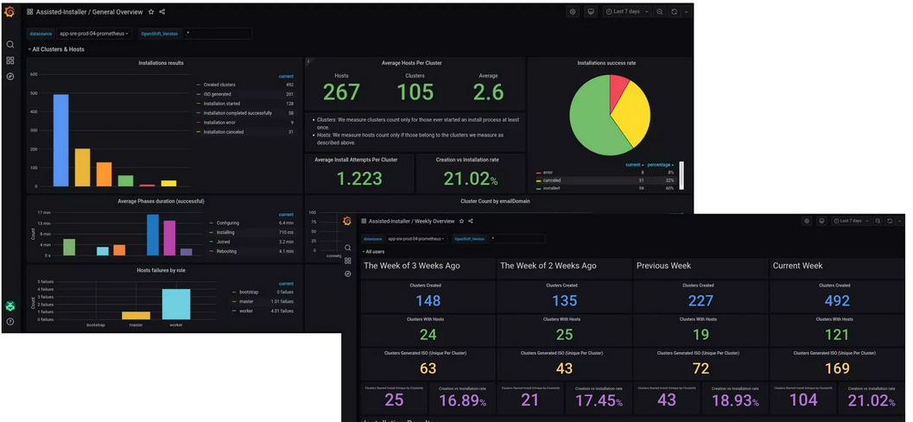
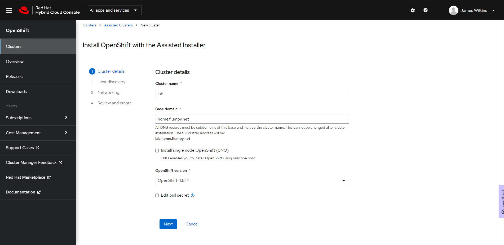
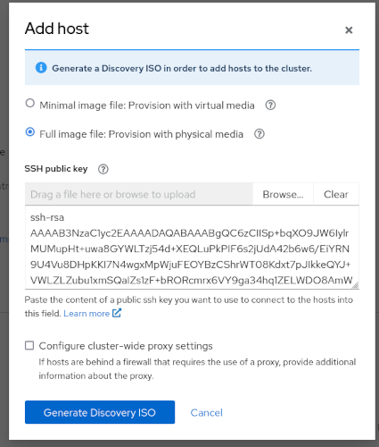
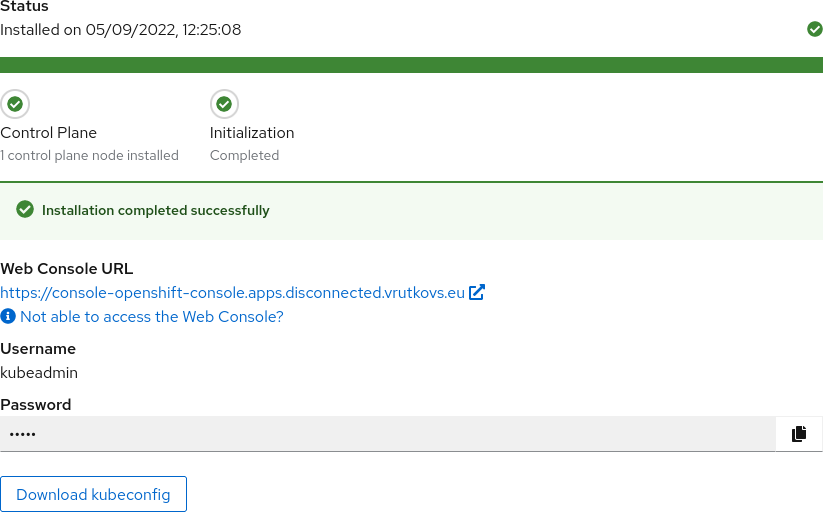

## Agent-based k8s installation
or
#### How I stopped worrying and learned to install k8s clusters
<br>
<br>
<br>
Vadim Rutkovsky

vrutkovs@redhat.com

---
### `whoami`
Principal software engineer from Belarus living in Czech Republic.

Working for Red Hat in the OpenShift department.

Note:

My job is to overlook cluster lifecycle, helping customers install clusters of various configuration, extend, upgrade and manage at scale.

---
### Problem statement
Cluster lifecycle FAQ:

* What happens during cluster installation? What if it goes sideways?

Note:

Customers need to know if installation method is flexible enough and support makes sure engineers don't come up with some crazy method. We also need a way to collect necessary information to find the problem

---
### Problem statement
Cluster lifecycle FAQ:

* Cluster got installed? Now repeat it a hundred times

Note:

Customers may want to install multiple clusters, so the installation method has to be resilient

---
### Problem statement

Cluster lifecycle FAQ:

* It seems easy to install a k8s cluster, can it be a self-service?

Note:

You may want to hand off cluster installation to developers and offer it as an internal service

---
### Problem statement

Cluster lifecycle FAQ:

* Can I use GitOps for this?

Note:

GitOps offers a way of tracking who did what and allows change review before they have happened, which might be useful for cluster installation

---
### The installer dilemma

Multiple possible ways - `kops`, `kubeadm`, `kubespray` etc.
These are balancing between two extremes:

---
### The installer dilemma

* Too generic

Note:
the method is too generic as you have to come up with additional tools and its hard to troubleshoot heavily customized installations (especially baremetal). For instance, `kubeadm` covers just the k8s part, not host preparation part.

---
### The installer dilemma

* Too specific

Note:
the method is too specific for particular provider - installs all the necessary infra in the cloud (i.e. via Terraform) which makes it harder to apply on baremetal installs.

---
### What? Another method?

Yes.

The focus here is Baremetal, as it requires careful configuration, a lot of customization and makes troubleshooting complicated.

Note:
we needed an installation method which tries to find the middle ground between two extremes, focusing on bare-metal installations

---
### What? Another method?

Requirements:

* Hide installation complexity
* Flexible infra requirements
* Help with troubleshooting

Note:
This leads us to an idea of Assisted Installer - a tool which helps you identify if your cluster settings are valid and nodes fulfil the requirements


---
### Agent-based method
Boot into a Live ISO and receive host information



Note:
Instead of booting into real OS and getting started with kubelet and certificates lets first collect information about available hosts. In order to do that we need to boot every machine via a Live ISO and have a special agent there which fetches necessary information. This service would send it to the DB, which can be queried by a service (say, web-based) and a pretty UI on top of it.

This would help us solve several problems:

* Before cluster installation we filter out broken machines - if it can't run the agent it won't run kubelet
* Have a full overview of available hosts
* Establish a communication channel with the machine without SSH

---
### It Takes Two to Tango

Bidirectional channel - the host can send logs back, the service can send commands to run on the host

Note:
A communication channel is important, as now the hosted service can now send and receive files from the host, meaning:

* Necessary files like configuration, certificates etc can be sent on host
* The host can return error messages or logs if particular operation fails

---
### Fully Automated Gay Space Luxury Installation

API is 💪



Note:
Since we rely on hosted service, we might as well run the installer there and send artifacts on the service. This allows us limit the inputs from the user and improves reproducibility. As a result, the hosted service can be API-driven, which enabled careful tweaking and improved control over the installation process.

---
### Pretty is a feature

Since the service has an API, it can be visualized - using a Web UI



Note:
Cute UI is always a thing which makes UX easy for newcomers and helps user to spend less time doing boring things like setting up a cluster

---
### Validations
Find problems before installation begins, such as:
* Nodes unable to communicate with each other
* Credentials to pull images are invalid
* Slow disks for control plane nodes

And many more



---
### Isn't it Ironic?
IPMI / RedFish etc -> Declarative automatic discovery and provisioning



Note:
Assisted Service also includes OpenStack Ironic, which unlocks the ability to discover and configure machines via IPMI, RedFish etc.

---
### Live installation progress
UI shows installation progress:
* Control plane preparation
* Nodes joining the cluster
* Finalization


Note:
A lot of things may go wrong during cluster installation, so users need to be notified about problems and be aware of current progress

---
### But how do I ...?

There are quite a lot of other problems we'd need to cover:

---
### But how do I ...?

#### Networks

OpenShift uses `NMState` operator to prepare NetworkManager configuration to setup network parameters on installation.

Note:
Networking is never easy. In Openshift Assisted Service we're relying on NetworkManager to configure it for us. NetworkManager configuration can be generated from manifests using NMState operator

---
### But how do I ...?

#### Customized node configuration

`Ignition` - https://coreos.github.io/ignition/

Note:
Ignition is used in OpenShift to create necessary files / systemd services to customize node contents. Assisted Service may also receive additional k8s manifests we want to be applied during installation (i.e. different CNI, ArgoCD installation and subscription etc.)

---
### But how do I ...?

#### Can use another k8s distro?

"Vanilla" Kubernetes is a too broad of a term, needs to be narrowed down.

Note:
Vanilla k8s comes in different sizes, so in order to make a viable service it needs to be narrowed down to a particular scope - focusing on NetworkManager, selecting an OS which can be provisioned with Ignition etc. etc.
---
### Why not Cluster API?

Validations would not stop the broken cluster from installing.

Related work:

https://github.com/vmware-tanzu/cluster-api-provider-bringyourownhost

https://github.com/openshift/cluster-api-provider-agent

Note:
Cluster API is a great tool to spin up new cluster, but it didn't fit our purposes. The biggest problem here is that the installation has already started, so host validations cannot prevent the misconfigured cluster from starting the installation. However, if you want to follow that route Tanzu folks have a provider which uses similar idea.
It is also fairly easy to build a Cluster API provider using Openshift Assisted Installer agents too.

---
### Lies, damned lies and statistics
Collect cluster installation success rate, find problems sooner etc.



Note:
Since the agent is reporting clsuter status to the central service we as service providers can easily spot regressions in the service configuration by analyzing pass rate for installed clusters. This helps us maintain 75% of installation success rate

---
### Hello operator

Since its a webservice, it can run in k8s. Moreover, it can also fetch input from k8s manifests and start installation in a declarative hands-off mode.

Note:
We also offer this service as a part of Advanced Kubernetes Management product and in order to make API accessible to the power users, its being served as a k8s operator. This allows us to define cluster properties as k8s custom resources

---
### Of course it supports GitOps

#### Zero Touch Provisioning

Cluster definition stored in Git, applied by Flux/ArgoCD, reconciled by the operator

Note:
Since we can now start cluster installation via a handful of k8s manifests, these can be stored in a gitrepo and applied automatically - GitOps methods.

In OpenShift speak this method is called "Zero Touch Provisioning"

---
### Screenshot: Cluster details



---
### Screenshot: Discovery ISO



---
### Screenshot: Discovered hosts


---
### Screenshot: Network Settings


---
### Screenshot: Installation progress


---
### tada.wav


---
### Operator: Network Configuration

```yaml
apiVersion: agent-install.openshift.io/v1beta1
kind: NMStateConfig
metadata:
  name: assisted-deployment-nmstate-lab-spoke
  labels:
    cluster-name: nmstate-lab-spoke
spec:
  interfaces:
    - name: "eth0"
      macAddress: "02:00:00:80:12:14"
    - name: "eth1"
      macAddress: "02:00:00:80:12:15"
  config:
    interfaces:
      - name: bond99
        type: bond
        state: up
        ipv6:
          address:
          - ip:2620:52:0:1302::100
            prefix-length: 64
          enabled: true
        link-aggregation:
          mode: balance-rr
          options:
            miimon: '140'
          slaves:
          - eth0
          - eth1
```

---
### Operator: Provision via RedFish

```yaml
apiVersion: metal3.io/v1alpha1
kind: BareMetalHost
metadata:
  name: lab-agent1
  namespace: open-cluster-management
  labels:
    infraenvs.agent-install.openshift.io: "lab-env"
spec:
  online: true
  bmc:
    address: redfish-virtualmedia+http://[2620:52:0:1302::d7c]:8000/redfish/v1/Systems/3e6f03bb-2301-49c9-a562-ad488dca513c
    credentialsName: bmc-secret1
    disableCertificateVerification: true
  bootMACAddress: ee:bb:aa:ee:1e:1a
  automatedCleaningMode: disabled
```

---
### Epilogue

Agent-based installation gives several benefits over traditional ways of installing a cluster:

* User input validation the cluster settings before writing anything to disk
* Provides an API which unlocks self-service and automation
* Combines infra flexibility and UX

---
### Questions?

Find me at https://vrutkovs.eu

https://vrutkovs.github.io/slides-k8s-agent-based/


---
### Links

More information:

* https://github.com/openshift/assisted-service
* https://cloud.redhat.com/blog/how-to-use-the-openshift-assisted-installer
* https://vrutkovs.eu/posts/okd-disconnected-assisted/
* https://cloud.redhat.com/blog/telco-5g-zero-touch-provisioning-ztp
